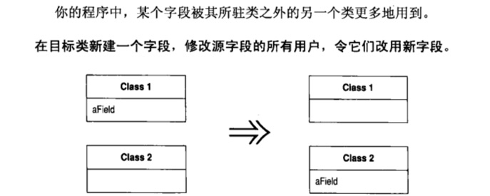
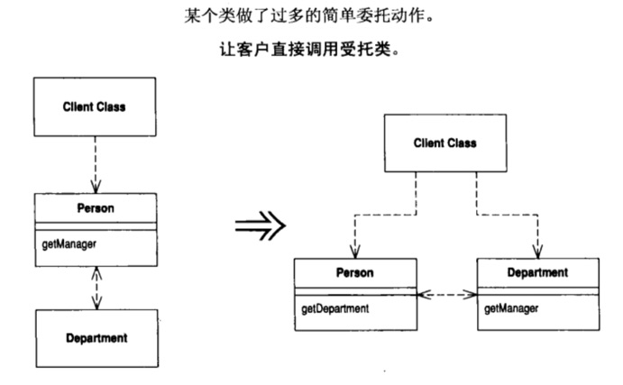
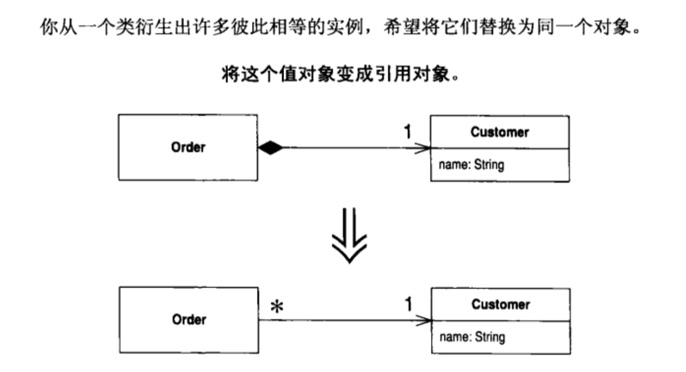
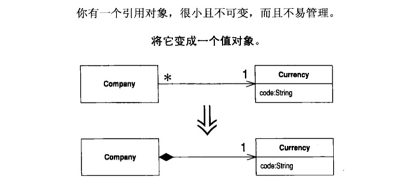
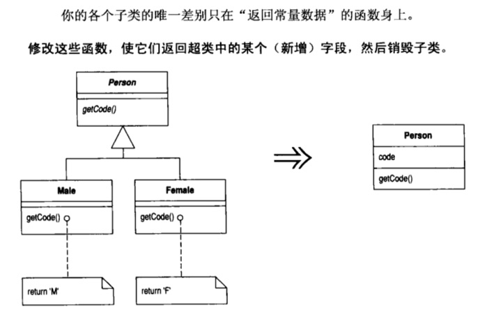
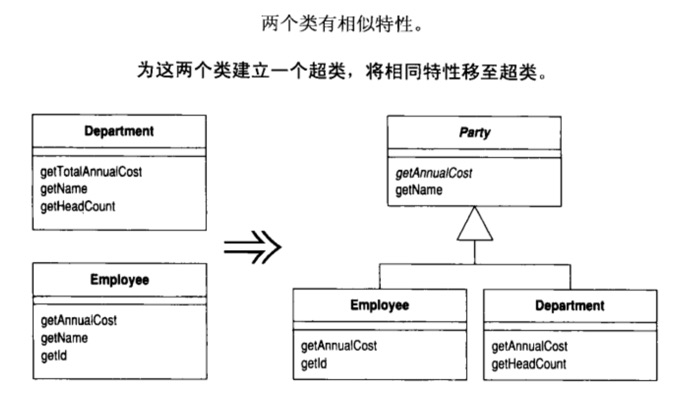

# 《重构：改善既有代码的设计》读书笔记

> 任何一个傻瓜都能写出计算机可以理解的代码。惟有写出人类容易理解的代码，才是优秀的程序员。
>
> 代码被阅读和被修改的次数远远多于它被编写的次数。
> 
> 保持代码易读、易修改的关键，就是重构。

## 什么是重构
> 在不改变代码外在行为的前提下，对代码做出修改，以改进程序的内部结构。
> 
> 在代码写好之后改进它的设计。

## 为何重构
* 改进软件设计
* 使软件更易被理解
* 帮助找到 bugs
* 提高编程速度

## 为什么开发者不愿意重构他们的程序
* 不知道如何重构
* 如果这些利益是长远的，何必现在付出这些努力呢
* 代码重构是一项额外工作
* 重构可能破坏现有程序

## 何时重构
* 三次法则

第一次做某件事时只管去做；第二次做类似的事会产生反感，但无论如何还是做了；第三次再做类似的事，你就应该重构。

* 添加功能时一并重构
* 修补错误时一并重构
* 复审代码时一并重构

## 如何重构
### 重构之前
* [代码的坏味道](#%E4%BB%A3%E7%A0%81%E7%9A%84%E5%9D%8F%E5%91%B3%E9%81%93)
* [构筑测试体系](#%E6%9E%84%E7%AD%91%E6%B5%8B%E8%AF%95%E4%BD%93%E7%B3%BB)

### 小型重构
都可以在数分钟（至多一个小时）内完成。
* [a-重新组织你的函数](#a-%E9%87%8D%E6%96%B0%E7%BB%84%E7%BB%87%E4%BD%A0%E7%9A%84%E5%87%BD%E6%95%B0)
* [b. 在对象之间搬移特性
](#b-%E5%9C%A8%E5%AF%B9%E8%B1%A1%E4%B9%8B%E9%97%B4%E6%90%AC%E7%A7%BB%E7%89%B9%E6%80%A7)
* 
* 
* 
* 

### 大型重构
需要数月甚至数年的时间。
* 
* 
* 
* 

### [集成]()
### 重构工具
* sonar 代码扫描
* IntelliJ IDEA, Android stuidio, Xcode analyze, refactor
* lint

## 其它
### 设计模式和重构
设计模式为重构提供了目标。

模式是你希望到达的目标，重构则是到达之路。

### 先设计后编码
首先得有一个良好的设计，然后才开始编码。但是，随着时间流逝，人们不断修改代码，于是根据原先设计所得的系统，整体结构逐渐衰弱。代码质量慢慢沉沦，编码工作从严谨的工程堕落为胡砍乱劈的随性行为。
### 先编码后重构
重构正好相反。哪怕你手上有一个糟糕的设计，甚至是一堆混乱的代码，你也可以借助重构将它加工成设计良好的代码。重构的每个步骤都很简单，甚至简单过了头。但是，聚沙成塔，这些小小的修改累积起来就可以根本改善设计质量。

### 两顶帽子
* 添加新功能
	* 不应该修改既有代码，只管添加新功能。
* 重构
	* 不能添加新功能，只管改进程序结构。

### 重构与性能
* 首先写出易理解的代码
* 出现性能问题时再做优化

# 代码的坏味道
* 重复的代码
* 过长函数
* 过大类
* 过长参数列
* 发散式变化，Divergent Change
	* 如果某个 class 经常因为不同的原因在不同的方向上发生变化，应当拆分成多个 class
* 霰弹式修改，Shortgun Surgery
	* 如果遇到某种变化，需要修改多个 class，应该合并这些 class 为一个 class
* 依恋情结，Feature Envy
	* 函数对某个 class 的兴趣高过对自己本身所在的 class
* 数据泥团，Data Clumps
	* 如果多个 class 有相同的 field，method，应该 Extract Class
* 基本类型偏执
	* type code 替换为对象
* switch 惊悚现身
* 平行继承体系
	* 每当你为某个 class 增加一个 subclass，必须也为另一个 class 响应增加一个 subclass
* 冗赘类，Lazy Class
	* 删除掉，庄严赴义
* 夸夸其谈未来性，Speculative Generality
* 令人迷惑的暂时 field
* 过度耦合的消息链
	* getA()->getB()->getC()->getD()...
* 中间转手人
* 狎昵关系，Inappropriate Intimacy
	* 两个类过度亲密，花费太多时间去探究彼此的 private 成分
* 异曲同工的类
* 不完善的程序类库
	* 想要扩展类库的功能
* 纯稚的数据类，Data Class
* 被拒绝的遗赠
	* 子类不想要父类的数据或函数
* 过多的注释

# 构筑测试体系
编写优良的测试程序，可以极大提高编程速度，这违反许多程序员的直觉。
### 自我测试代码的价值
如果认真观察程序员把最多时间耗在哪里，你就会发现，编写代码其实只占非常小的一部分。有些时间用来决定下一步干什么，另一些时间花在设计上面，最多的时间则是用来调试。

修复错误通常是比较快的，但找出错误却是噩梦一场。

> 确保所有测试都完全自动化，让它们检查自己的测试结果。
> 
> 一整组（a suilt of）测试就是一个强大的 bug 侦测器，能够大大缩减查找 bug 所需要的时间。

如果你想重构，就必须编写测试代码。

# a. 重新组织你的函数
## 1. Extract Method，提炼函数

## 2. Inline Method，将函数内联

## 3. Inline Temp，去掉临时变量

## 4. Replace Temp With Query，以查询取代临时变量

## 5. Introduce Explaining Variable，引入解释性变量

## 6. Split Temporary Variable，拆分临时变量

## 7. Remove Assignments to Parameters，不要对参数赋值

## 8. Replace Method with Method Object，以函数对象取代函数

## 9. Substitute Algorithm，替换你的算法

# b. 在对象之间搬移特性
## 1. Move Method，移动函数

## 2. Move Field，移动成员变量

## 3. Extract Class，提炼类

## 4. Inline Class，将类内联

## 5. Hide Delegate，隐藏委托关系

## 6. Remove Middle Man，移除中间人

## 7. Introduce Foreign Method，引入外加函数

## 8. Introduce Local Extension，引入本地扩展

# c. 重新组织数据
## 1. Self Encapsulate Field，自封装字段

## 2. Replace Data Value with Object，以对象取代数据值

## 3. Change Value to Reference，将传值改为引用

## 4. Chang Reference to Value，将引用改为传值

## 5. Replace Array with Object，以对象取代数组

## 6. Duplicate Observed Data，复制被观察数据

## 7. Change Unidirectional Association to Bidirectional，将单向关联改为双向

## 8. Change Bidirectional Association to UniDirectional，将双向关联改为单向

## 9. Replace Magic Number with Symbolic Constant，以符号常量取代神秘数字

## 10. Encapsulate Field，封装字段

## 11. Encapsulate Collection，封装群集

## 12. Replace Record with Data Class，以数据类取代记录

## 13. Replace Type Code with Class，以类取代类型码

## 14. Replace Type Code with Subclasses，用子类取代类型码

## 15. Replace Type Code with State/Strategy，用状态策略模式取代类型码

## 16. Replace Subclass with Fields，以字段取代子类

# d. 简化条件表达式
## 1. Decompose Conditional，分解条件式

## 2. Consolidate Conditional Expression，合并条件式

## 3. Consolidate Duplicate Conditional Fragments，合并重复的条件判断

## 4. Remove Control Flag，移除控制标记

## 5. Replace Nested Conditional With Guard Clauses，以卫语句取代嵌套条件式

## 6. Replace Conditional with Polymorphism，以多态取代条件式

## 7. Introduce Null Object，引入 Null 对象

## 8. Introduce Assertion，引入断言

# e. 简化函数调用
## 1. Rename Method，重新命名函数

## 2. Add Parameter，添加参数

## 3. Remove Parameter，移除参数

## 4. Separate Query from Modifier，将查询函数和修改函数分离

## 5. Parameterize Method，令函数携带参数

## 6. Replace Parameter with Explicit Methods，以明确函数取代参数

## 7. Preserve Whole Object，保持对象完整

## 8. Replace Parameter with Method，以函数取代参数

## 9. Introduce Parameter Object，引入参数对象

## 10. Remove Setting Method，移除 setter 函数

## 11. Hide Method，隐藏某个函数

## 12. Replace Constructor with Factory Method，以工厂函数取代构造函数

## 13. Encapsulate Downcast，封装类型转换动作

## 14. Replace Error Code with Exception，以异常取代错误码

## 15. Replace Exception with Test，以测试取代错误码

# f. 处理继承关系
## 1. Pull Up Field，字段上移

## 2. Pull Up Method，函数上移

## 3. Pull Up Constructor Body，构造函数内容上移

## 4. Pull Down Method，函数下移

## 5. Pull Down Field，字段下移

## 6. Extract Subclass，提炼子类

## 7. Extract Superclass，提炼超类

## 8. Extract Interface，提炼接口

## 9. Collapse Hierarchy，折叠继承体系

## 10. Form Template Method，塑造模板函数

## 11. Replace Inheritance with Deletation，以委托取代继承

## 12. Replace Delegation with Inheritance，以继承取代委托

# 大型重构
## 1. 梳理并分解继承体系

## 2. 将过程化设计转化为对象设计

## 3. 将领域和表述/显示分离

## 4. 提炼继承体系

# 集成
* 随时挑一个目标
* 没把握就停下来
* 学习原路返回
* 二重奏。和别人一起重构，可以收到更好的效果。

	

